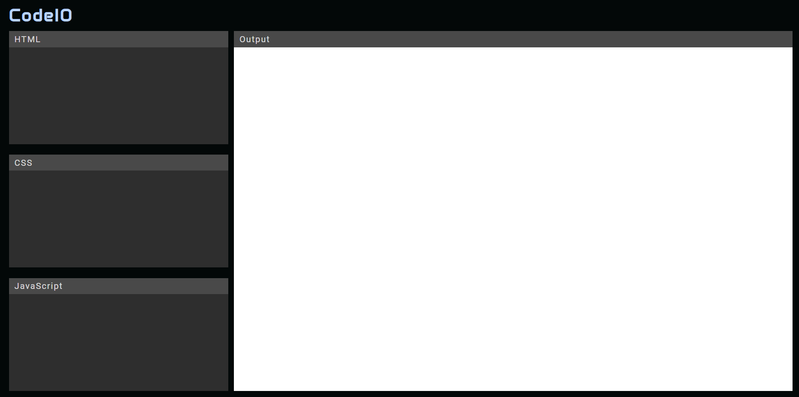

# CodeIO

CodeIO is a web application that allows users to write, test, and experiment with HTML, CSS, and JavaScript code directly in their web browser. Similar to platforms like CodePen, it provides a convenient environment for developers and designers to quickly prototype, showcase, and share their code snippets and projects.



## Features

- Live HTML, CSS, and JavaScript editor
- Real-time preview of code changes

## Demo

Check out the [live demo](https://rht-21.github.io/codeIO) to see CodeIO in action!

## Installation

To run CodeIO locally, follow these steps:

1. Clone the repository:

```bash
git clone https://github.com/rht-21/codeIO.git
```

2. Navigate to the project directory:

```bash
cd codeIO
```

Open index.html in your preferred web browser.

3. Usage:

- Open CodeIO in your web browser.
- Use the editor panels to write your HTML, CSS, and JavaScript code.
- Preview your code in real-time in the adjacent preview pane.
